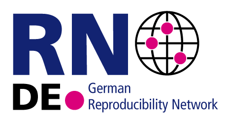

.. OSE-course-projects documentation master file, created by
   sphinx-quickstart on Mon Jun  8 20:12:30 2020.
   You can adapt this file completely to your liking, but it should at least
   contain the root `toctree` directive.

.. |logo| image:: https://raw.githubusercontent.com/OpenSourceEconomics/ose-corporate-design/master/logos/OSE_logo_no_type_RGB.svg
  :width: 4 %

|logo| OSE course projects
==========================

.. image:: https://github.com/OpenSourceEconomics/ose-course-projects/workflows/Continuous%20Integration/badge.svg
    :target: https://github.com/OpenSourceEconomics/ose-course-projects/actions

.. image:: https://img.shields.io/badge/code%20style-black-000000.svg
    :target: https://github.com/psf/black

.. image:: https://img.shields.io/badge/zulip-join_chat-brightgreen.svg
    :target: https://bonn-econ-teaching.zulipchat.com

.. image:: https://img.shields.io/badge/License-MIT-yellow.svg
    :target: https://github.com/OpenSourceEconomics/ose-course-projects/blob/master/LICENSE

.. image:: https://readthedocs.org/projects/ose-course-projects/badge/?version=latest
    :target: https://ose-course-projects.readthedocs.io

Our two courses `OSE data science <https://ose-data-science.readthedocs.io>`_ and `OSE scientific computing <https://ose-data-science.readthedocs.io>`_ both requires students to work on their projects independently. This documentation includes some basic instructions and example projects.

.. toctree::
   :maxdepth: 1

   repository-template/index
   reproducibility/index
   replications/index
   collaborations/index
   frequently-asked-questions/index

Powered by
----------

|space| |space| |OSE| |space| |GRN|

.. |OSE| image:: https://raw.githubusercontent.com/OpenSourceEconomics/ose-corporate-design/master/logos/OSE_logo_RGB.svg
  :width: 22 %
  :target: https://open-econ.org
  

.. |space| raw:: html

     <embed>
	 &nbsp; &nbsp; &nbsp; &nbsp; &nbsp; &nbsp; &nbsp; &nbsp; &nbsp;
     </embed>

We gratefully acknowledge funding by the Federal Ministry of Education and Research (BMBF) and the Ministry of Culture and Science of the State of North Rhine-Westphalia (MKW) as part of the Excellence Strategy of the federal and state governments.
